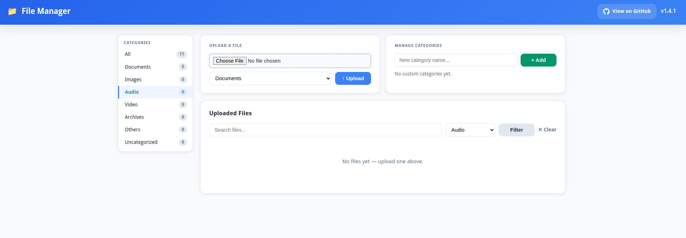

# File Upload Application

A robust file upload system built with Flask and Nginx, designed for secure and efficient file handling with shared storage.

## Overview

This application provides a user-friendly interface for uploading files with the following key features:

- File upload form with extension validation
- File listing and management interface
- Direct file serving via `/uploads/<filename>`
- Nginx reverse proxy for production-grade performance
- Shared upload storage between containers



## Features

| Feature                     | Description                                                                                     |
|-----------------------------|---------------------------------------------------------------------------------------------|
| File Upload Form           | Web interface for uploading files with allowed extensions validation                     |
| File Listing                | View all uploaded files with metadata (name, size, upload date)                           |
| Direct File Access          | Serve uploaded files directly via `/uploads/<filename>` endpoint                           |
| Nginx Reverse Proxy         | Production-ready setup with Nginx in front of Flask application                          |
| Shared Storage              | Persistent upload storage shared between containers                                         |
| Docker Support              | Complete containerized deployment with Docker Compose                                      |
| Gunicorn Support            | Production-ready WSGI server for handling requests                                          |

## Prerequisites

Before you begin, ensure you have the following installed:

- [Docker](https://docs.docker.com/get-docker/)
- [Docker Compose](https://docs.docker.com/compose/install/)
- Python 3.8+ (for local development)
- Git

## Installation

1. Clone this repository:
   ```bash
   git clone https://github.com/your-repo/upload-file.git
   cd upload-file
   ```

2. Build and start the containers:
   ```bash
   docker-compose up --build
   ```

## Docker Image

A pre-built Docker image is available on GitHub Container Registry (GHCR):

```bash
docker pull ghcr.io/ftsiadimos/upload_file:latest
```

## Configuration

### Environment Variables

Configure the application using environment variables in your `.env` file:

```env
# Flask Configuration
FLASK_APP=wsgi.py
FLASK_ENV=development

# Allowed file extensions
ALLOWED_EXTENSIONS=pdf,docx,xlsx,png,jpg,jpeg,gif,zip,tar

# Upload settings
UPLOAD_FOLDER=./uploads
MAX_CONTENT_LENGTH=16MB
```

### Docker Configuration

The application uses Docker Compose for container management. Key components:

- **Flask App**: Runs on port 5000
- **Nginx**: Acts as reverse proxy on port 9999
- **Shared Storage**: Files are stored in both `./uploads` (local) and `/var/www/uploads` (container)

## Usage

### Accessing the Application

After starting the containers:

- **Application UI**: `http://localhost:9999`
- **File Upload**: Navigate to `/upload` in the browser
- **File Listing**: View all uploaded files at `/uploads`
- **Direct File Access**: Access files via `http://localhost:9999/uploads/<filename>`

### Running Locally (Without Docker)

1. Install dependencies:
   ```bash
   pip install -r requirements.txt
   ```

2. Run the application:
   ```bash
   export FLASK_APP=wsgi.py
   flask run
   ```

3. For production, use Gunicorn:
   ```bash
   gunicorn -w 2 wsgi:app
   ```

## Allowed File Extensions

The application restricts uploads to specific file types for security. Currently allowed extensions:

```
pdf, docx, xlsx, png, jpg, jpeg, gif, zip, tar
```

To change allowed extensions, modify the `ALLOWED_EXTENSIONS` environment variable.

## File Size Limits

The application enforces a maximum file size of 16MB. To change this limit:

1. Modify the `MAX_CONTENT_LENGTH` environment variable
2. Update the Nginx configuration for client_max_body_size

## Troubleshooting

### Common Issues

**Issue: Application not starting**
- Check Docker containers: `docker-compose ps`
- View logs: `docker-compose logs`
- Ensure ports are not in use

**Issue: Files not appearing**
- Verify the upload folder permissions: `chmod -R 755 uploads`
- Check Nginx configuration for proper file serving
- Ensure Docker volumes are correctly mounted

**Issue: 403 Forbidden errors**
- Verify file permissions in the upload directory
- Check Nginx error logs: `docker-compose logs nginx`
- Ensure the upload folder is accessible by both containers

## Contributing

Contributions are welcome! Please follow these steps:

1. Fork the repository
2. Create a feature branch (`git checkout -b feature/your-feature`)
3. Commit your changes (`git commit -m 'Add some feature'`) 
4. Push to the branch (`git push origin feature/your-feature`)
5. Open a Pull Request

## License

This project is licensed under the MIT License - see the [LICENSE](LICENSE) file for details.

## Contact

For questions or support, please contact:

- Email: your-email@example.com
- GitHub Issues: [Open an issue](https://github.com/your-repo/upload-file/issues)
